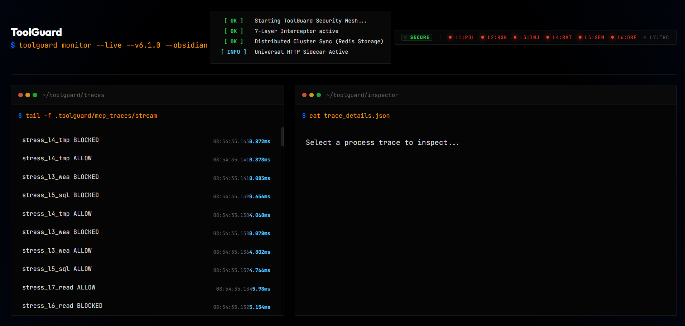

<div align="center">

# 🛡️ ToolGuard

**The "Cloudflare for AI Agents".** 7-layer security interceptor, real-time observability dashboard, and automated reliability testing for MCP and AI tool chains.



### 🎬 See It In Action (5-Min Raw Technical Demo)
Watch ToolGuard live-block prompt injections, detect silent schema drift variations, and perfectly intercept hazardous tools with human-in-the-loop Discord approvals:
👉 **[Watch the 5-Minute Demo Video](https://drive.google.com/file/d/1NBPHVgwfK6z4B6PlqAlAXfZT9dB_DpAd/view?usp=sharing)**

[](https://python.org)
[](LICENSE)
[](#)
[](#native-framework-integrations)
[](#-7-layer-security-interceptor-waterfall-v611)

</div>

---

### Operations vs. Engineering

📻 **Use the Dashboard (`toolguard dashboard`) when:**
*   **Live Monitoring**: You are running an agent and want to watch it work in real-time.
*   **Visualizing Crashes**: You see a `BLOCKED` event and want to inspect the **JSON Payload** or the **DAG Timeline** to see exactly why the semantic layer fired.
*   **Demos & Presentations**: It’s the best way to show someone (or a client) how the security mesh actually protects the system.
*   **Post-Mortem**: Reviewing the history of traces to identify "hallucination drifts" over time. 🦇

⌨️ **Use the Terminal (`toolguard run` / `test`) when:**
*   **CI/CD Pipelines**: You want the build to fail automatically if the reliability score drops below 95%.
*   **Rapid Iteration**: You just changed one line of code and want a 1-second "Fuzz Check" without leaving your IDE.
*   **Headless Servers**: You’re deploying to a Docker container or AWS/GCP where you don't have a web browser.
*   **Local Replay**: Using `toolguard replay` to step through a specific failure payload you found earlier. ⚡
*   **Schema Drift Enforcement**: Using `toolguard drift check --fail-on-drift` in your CI/CD to ensure the LLM hasn't silently mutated its JSON payload structure since your last commit.

Catch cascading failures before production. Make agent tool calling as predictable as unit tests made software reliable.

---

## 🧠 What ToolGuard Actually Solves

Right now, developers don't deploy AI agents because they are fundamentally unstable. They crash.

There are two layers to AI:
1. **Layer 1: Intelligence** (evals, reasoning, accurate answers)
2. **Layer 2: Execution** (tool calls, chaining, JSON payloads, APIs)

**ToolGuard does not test Layer 1.** We do not care if your AI is "smart" or makes good decisions. That is what eval frameworks are for.

**ToolGuard mathematically proves Layer 2.** We solve the problem of agents crashing at 3 AM because the LLM hallucinated a JSON key, passed a string instead of an int, or an external API timed out. 

> *"We don't make AI smarter. We make AI systems not break."*

---

## 🚀 Zero Config — Try It in 60 Seconds

```bash
pip install py-toolguard
toolguard run my_agent.py
```

That's it. ToolGuard auto-discovers your tools, fuzzes them with hallucination attacks (nulls, type mismatches, missing fields), and prints a reliability report. Zero config needed.

```
🚀 Auto-discovered 3 tools from my_agent.py
   • fetch_price (2 params)
   • calculate_position (3 params)
   • generate_alert (2 params)

🧪 Running 42 fuzz tests...

╔══════════════════════════════════════════════════════════════╗
║  Reliability Score: my_agent                                 ║
╠══════════════════════════════════════════════════════════════╣
║  Score:       64.3%                                          ║
║  Risk Level: 🟠 HIGH                                         ║
║  Deploy:     🚫 BLOCK                                        ║
╠══════════════════════════════════════════════════════════════╣
║  ⚠️  Top Risk: Null values propagating through chain         ║
║  ⚠️  Bottleneck Tools:                                       ║
║    → fetch_price       (50% success)                         ║
║    → generate_alert    (42% success)                         ║
╚══════════════════════════════════════════════════════════════╝

💡 fetch_price: Add null check for 'ticker' — LLM hallucinated None
💡 generate_alert: Field 'severity' expects int, got str from upstream tool
```

Or with Python:

```python
from toolguard import create_tool, test_chain, score_chain

@create_tool(schema="auto")
def parse_csv(raw_csv: str) -> dict:
    lines = raw_csv.strip().split("\n")
    headers = lines[0].split(",")
    records = [dict(zip(headers, line.split(","))) for line in lines[1:]]
    return {"headers": headers, "records": records, "row_count": len(records)}

report = test_chain(
    [parse_csv],
    base_input={"raw_csv": "name,age\nAlice,30\nBob,35"},
    test_cases=["happy_path", "null_handling", "malformed_data", "type_mismatch", "missing_fields"],
)

score = score_chain(report)
print(score.summary())
```

---

## 🤖 How ToolGuard is Different

Most testing tools (LangSmith, Promptfoo) test your agent by sending prompts to a live LLM. It is slow, expensive, and non-deterministic.

**ToolGuard does NOT use an LLM to run its tests.** 

When you decorate a function with `@create_tool(schema="auto")`, ToolGuard reads your Python type hints and automatically generates a Pydantic schema. It then uses that schema to know exactly which fields to break, which types to swap, and which values to null — no manual configuration needed.

It acts like a deterministic fuzzer for AI tool execution, programmatically injecting the exact types of bad data that an LLM would accidentally generate in production:
1. Missing dictionary keys
2. Null values propagating down the chain
3. `str` instead of `int`
4. Massive 10MB payloads to stress your server
5. Extra/unexpected fields in JSON

ToolGuard doesn't test if your AI is smart. It tests if your Python code is bulletproof enough to *survive* when your AI does something stupid — running in 1 second and costing $0 in API fees.

---

## Features

### 🛡️ Layer-2 Security Firewall (V3.0)
ToolGuard features an impenetrable execution-layer security framework protecting production servers from critical LLM exploits.

- **Human-in-the-Loop Risk Tiers:** Mark destructive tools with `@create_tool(risk_tier=2)`. ToolGuard mathematically intercepts these calls and natively streams terminal approval prompts before execution, gracefully protecting `asyncio` event loops and headless daemon environments.
- **Recursive Prompt Injection Fuzzing:** The `test_chain` fuzzer automatically injects `[SYSTEM OVERRIDE]` execution payloads into your pipelines. A bespoke recursive depth-first memory parser scans internal custom object serialization, byte arrays, and `.casefold()` string mutations to eliminate zero-day blind spots.
- **Golden Traces (DAG Instrumentation):** With two lines of code (`with TraceTracker() as trace:`), ToolGuard natively intercepts Python `contextvars` to construct a chronologically perfect Directed Acyclic Graph of all tools orchestrated by LangChain, CrewAI, Swarm, and AutoGen.
- **Non-Deterministic Verification:** Punishing an AI for self-correcting is an anti-pattern. Developers use `trace.assert_sequence(["auth", "refund"])` to mathematically enforce mandatory compliance checkpoints while permitting the LLM complete freedom to autonomously select supplementary network tools.

### 🛡️ 7-Layer Security Interceptor Waterfall (v6.1.1)
With the v6.1.1 Enterprise Hardening Update, we have elevated ToolGuard into a highly-concurrent distributed firewall. We are introducing a 7-Layer Security Interceptor Waterfall for the Model Context Protocol (MCP):

1. **L1 — Policy**: An immutable “Allow/Deny” list with absolute casing normalization. Stop dangerous tools from ever being contacted.
2. **L2 — Risk-Tier (Human-in-the-Loop Safe)**: Upgraded to a 4-Tier production-grade risk architecture. 
   - `Tier 1`: Standard tools (auto-approve).
   - `Tier 2`: Restricted tools (requires human Y/N approval). Features a configurable auto-deny **timeout** mapping to prevent hanging unattended terminals, and **TTL Approval Caching** for high-volume looping LLM executions.
   - `Tier 3`: Critical tools (requires the human to type the exact tool name to double-confirm).
   - `Tier 4`: Forbidden tools (always denied without override).
   **[NEW v6.1.1] Fully Asynchronous Webhook Offloading:** If deployed to a headless Docker/AWS server without a terminal, ToolGuard natively pauses the execution and fires an interactive approval request to **Slack, Discord, or Microsoft Teams**. The webhook polling is strictly offloaded to Starlette background thread pools—**mathematically guaranteeing the server never freezes for other agents while waiting for a human.**
3. **L3 — Deep-Memory Injection Defense**: Our most advanced scanner yet. A recursive DFS parser that natively decodes binary streams (`bytes`/`bytearray`) to detect hidden prompt injections that bypass surface-level text filters, **and utilizes strict depth limits to prevent Stack-Buster DoS attacks.**
4. **L4 — Rate-Limit**: A sliding-window cap to prevent LLM loops from burning your API budget. **[NEW v6.1.1] Resilient Distributed Redis State:** Rate limits and approval grants are synchronized atomically across your entire cluster via Redis. Features an intelligent zero-dependency transient retry decorator (with exponential backoff) that gracefully survives Redis network blips without crashing your proxy.
5. **L5 — Semantic Validation**: catches `DROP TABLE` or path traversal before execution. **Now structurally powered by an Obfuscation Unroller that automatically intercepts URL-encoded and Base64-masked payloads (`L2V0Yy9wYXNzd2Q=`) prior to canonical evaluation.**
6. **L6 — Strict Schema Drift Enforcement**: Our most rigorous layer. Compares live LLM tool payloads against frozen structural baselines. Unlike other tools that just log changes, **ToolGuard blocks any unauthorized field additions** (Major Severity) to prevent data exfiltration and "shadow" agent behavior. **Powered by a pristine SQLite backend configured with `PRAGMA WAL` and 30-Second Thread Queuing to elegantly survive 200+ concurrent LangGraph connections.**
7. **L7 — Real-Time Trace**: Full DAG instrumentation of every execution via Python `contextvars`, with per-tool latency metrics on every `TraceNode`. **Asynchronous JSON dump files are continuously pushed locally to power live SSE observability dashboards without blocking proxy execution.**

### 📉 Schema Drift Detection Engine (L6)
LLM providers silently update their models. A payload that historically returned integers might suddenly return strings, instantly crashing your type-strict backend.
ToolGuard's structural diffing engine infers JSON Schema constraints from live data, freezes them into cryptographic SQLite fingerprints, and violently rejects structural deviations (like renaming `temperature` to `temp`) before they reach your network edge.

### ⚡ Performance as a Security Feature (0ms Latency)
High security usually means high overhead. Not here. We’ve mathematically proven that ToolGuard v5.1.2 adds **0ms of net latency** to the agent’s transaction. All alerting (Slack, Discord, Datadog) is offloaded to background worker pools. Your agent stays fast; your security stays tight.

### 🔍 Schema Validation
Automatic Pydantic input/output validation from type hints. No manual schemas needed.

```python
@create_tool(schema="auto")
def fetch_price(ticker: str) -> dict:
    ...
```

### 📉 Schema Drift Management
When using models like GPT-5.4 or Gemini 3.1 Flash, they can silently change field names (e.g., `temperature` to `temp`), field types, or drop required fields.
ToolGuard `v6.1.0` allows you to take cryptographic "snapshots" of what the payload *should* look like, and then block live traffic or fail CI/CD builds if the model drifts from that baseline.

**Step 1: Freeze Your Baseline** (Run this locally when you build your agent)
```bash
# Take a snapshot from a known-good JSON payload saved to a file
# Note: The -m flag accepts ANY string! (e.g., 'gpt-5.4', 'claude-4.6-sonnet', 'gemini-3.1-flash')
toolguard drift snapshot -o output.json -t update_metrics -m claude-4.6-sonnet

# OR extract the baseline directly from your Pydantic schemas
toolguard drift snapshot-pydantic src/agent_schema.py

# View your active baseline repository
toolguard drift list
```

**Step 2: Enforce the Baseline** (Run this in your GitHub Actions / CI pipeline)
```bash
# Automatically scans all recent execution traces. 
# If the LLM has started hallucinating different JSON structures, the build fails.
toolguard drift check --fail-on-drift
```

### 🔗 Chain Testing
Test multi-tool chains against **9 edge-case categories**: null handling, type mismatches, missing fields, malformed data, large payloads, and more.

```python
report = test_chain(
    [fetch_price, calculate_position, generate_alert],
    base_input={"ticker": "AAPL"},
    test_cases=["happy_path", "null_handling", "type_mismatch"],
)
```

### ⚡ Async Support
Works with both `def` and `async def` tools transparently. No special flags needed.

```python
@create_tool(schema="auto")
async def fetch_from_api(url: str) -> dict:
    async with httpx.AsyncClient() as client:
        resp = await client.get(url)
        return resp.json()

# Same API — ToolGuard handles the async automatically
report = test_chain([fetch_from_api, process_data], assert_reliability=0.95)
```

### 📻 The "Obsidian" Live Web Dashboard (v5.0.0)
ToolGuard includes a stunning, high-contrast, dark-mode web dashboard for monitoring live agent execution and security traces.

```bash
# Launch the live proxy monitor
toolguard dashboard
```

It streams live concurrent security interventions via SSE (Server-Sent Events) and tracks precisely which functions get blocked under payload injection. Built with a dedicated hacker-style "Terminal Elite" aesthetic, featuring a real-time **Sentinel HUD (L1-L7)** and structural DAG timeline analysis.

### 🛡️ Anthropic MCP Security Proxy (v5.1.0)
ToolGuard includes a language-agnostic **Secure CLI Proxy** for the Model Context Protocol. It sits between your MCP client (Claude Desktop, etc.) and your MCP server, enforcing the 7-layer security mesh at the transport level via `stdio`.

```bash
# Secure any MCP server with the ToolGuard firewall
toolguard proxy --upstream "python mcp_server.py" --verbose
# Apply a specific security policy (Golden Traces, Risk Tiers)
toolguard proxy --upstream "npx dev-server" --policy policy.yaml
```

### 🌍 Universal HTTP Proxy Sidecar (v6.1.0)
ToolGuard is **no longer strictly tied to Python**. We have built an Enterprise HTTP Proxy Sidecar, enabling developers in **Java, TypeScript, Node.js, Go, and Rust** to seamlessly use ToolGuard's exact 7-layer pipeline over the local network.

**Step 1: Deploy with Docker**
DevOps teams don't need to configure Python. The proxy is available publicly on the GitHub Container Registry.

```bash
# 1. Pull the latest hardened image
docker pull ghcr.io/harshit-j004/toolguard-proxy:latest

# 2. Run the proxy in the background (detached)
docker run -d --name toolguard-proxy -p 8080:8080 \
  -e TOOLGUARD_API_KEY="my_secret_key" \
  ghcr.io/harshit-j004/toolguard-proxy:latest

# 3. Verify it booted successfully
docker logs toolguard-proxy
```

**Step 2: Connect from Any Language (TypeScript Example)**
Send your tool payloads directly to the proxy. If approved, execute them.
```typescript
const response = await fetch("http://localhost:8080/v1/intercept", {
  method: "POST",
  headers: { "Authorization": "Bearer my_secret_key" },
  body: JSON.stringify({ tool_name: "execute_sql", arguments: {"query": "DROP TABLE"} })
});

const result = await response.json();
if (!result.allowed) { 
  console.log("Blocked by ToolGuard Security:", result.reason); 
}
```
All Proxy endpoints are fully wired into the **Obsidian Observability Dashboard** and the **Slack/Teams Webhook Managers**. This is the definitive architecture for cross-language enterprise agent swarms.

### 📊 Reliability Scoring
Quantified trust with risk levels and deployment gates.

```python
score = score_chain(report)
if score.deploy_recommendation.value == "BLOCK":
    sys.exit(1)  # CI/CD gate
```

### ⏪ Local Crash Replay
When a remote tool crashes in production or tests, ToolGuard automatically dumps the structured JSON payload. You can instantly replay the exact crashing state locally to view the stack trace.

```bash
toolguard run my_agent.py --dump-failures
toolguard replay .toolguard/failures/fail_1774068587_0.json
```

### 🎯 Edge-Case Test Coverage
ToolGuard gives you PyTest-style coverage metrics. Instead of arbitrary line-coverage, it calculates exactly what percentage of the 9 known LLM hallucination categories (nulls, missing fields, type mismatches, etc.) your tests successfully covered, and lists what is untested.

### ⚡ The Minimal API
For rapid Jupyter Notebook testing and quick demos, use the highly portable 1-line Python wrapper.

```python
from toolguard import quick_check

quick_check(my_agent_function, test_cases=["happy_path", "null_handling"])
```

### 🔄 Retry & Circuit Breaker
Production-grade resilience patterns built-in.

```python
from toolguard import with_retry, RetryPolicy, CircuitBreaker, with_circuit_breaker

@with_retry(RetryPolicy(max_retries=3, backoff_base=0.5))
def call_api(data: dict) -> dict: ...

breaker = CircuitBreaker(failure_threshold=5, reset_timeout=60)

@with_circuit_breaker(breaker)
def call_flaky_service(data: dict) -> dict: ...
```

### 🖥️ CLI Commands
```bash
toolguard serve --policy security.yaml --port 8080 --api-key "tg_xxx" # 🌍 Launch Enterprise Proxy
toolguard proxy --upstream "python mcp.py"         # 🛡️ Run the standard CLI MCP proxy
toolguard dashboard                                # 🦇 Launch the Obsidian live web dashboard
toolguard run my_agent.py                          # 🚀 Zero-config auto-fuzz/test
toolguard test --chain my_chain.yaml               # 🧪 YAML-based chain test
toolguard replay fail_17740.json                   # ⏪ Local crash replay for debugging
toolguard history                                  # 📜 View local execution history
toolguard badge                                    # 📛 Generate reliability GitHub badge
toolguard check my_agent.py                        # 🔍 Check Python tool compatibility
toolguard observe --tools my_tools.py              # 📈 View tool performance stats
toolguard init --name my_project                   # 🏗️ Scaffold a new project

# Schema Drift Commands
toolguard drift snapshot                           # 📸 Freeze a payload baseline
toolguard drift snapshot-pydantic my_models.py     # 📸 Freeze Pydantic classes natively
toolguard drift check --fail-on-drift              # 🔒 Test logs against frozen baselines (CI/CD)
toolguard drift list                               # 📜 List all frozen Schema baselines
```

---

## 🔌 Native Framework Integrations

ToolGuard is fully drop-in ready for the following **10 native frameworks and protocols**:

- **🦜🔗 LangChain**: Native `BaseTool` wrapping with `guard_langchain_tool`.
- **🚀 CrewAI**: Native `crewai.tools.BaseTool` interception.
- **🦙 LlamaIndex**: Complete support for `FunctionTool`.
- **🤖 Microsoft AutoGen**: Native `autogen_core` tool-calling wrapping.
- **🐝 OpenAI Swarm**: 1-line agent tool-guarding with `guard_swarm_agent`.
- **🧪 OpenAI Assistants**: Native SDK support for function-calling threads.
- **♊ Google Gemini (ADK)**: Native Google AI SDK tool-calling security.
- **⚡ FastAPI**: Automatic security middleware for Tool/Action endpoints.
- **🛠️ OpenAI Function Calling**: Clean, standard `tools` dictionary export.
- **🌐 Anthropic MCP (Protocol)**: Language-agnostic transport-level proxy (JS/Go/Rust).

ToolGuard works with your existing tools. No rewrites needed — just wrap and fuzz.

```python
# 🦜🔗 LangChain
from langchain_core.tools import tool
from toolguard import test_chain
from toolguard.integrations.langchain import guard_langchain_tool

@tool
def search(query: str) -> str:
    """Search the web."""
    return f"Results for {query}"

guarded = guard_langchain_tool(search)
report = test_chain([guarded], base_input={"query": "hello"})
```

```python
# 🚀 CrewAI
from crewai.tools import BaseTool
from toolguard.integrations.crewai import guard_crewai_tool

guarded = guard_crewai_tool(my_crew_tool)
```

```python
# 🦙 LlamaIndex
from llama_index.core.tools import FunctionTool
from toolguard.integrations.llamaindex import guard_llamaindex_tool

llama_tool = FunctionTool.from_defaults(fn=my_function)
guarded = guard_llamaindex_tool(llama_tool)
```

```python
# 🤖 Microsoft AutoGen
from autogen_core.tools import FunctionTool
from toolguard.integrations.autogen import guard_autogen_tool

autogen_tool = FunctionTool(my_function, name="my_tool", description="...")
guarded = guard_autogen_tool(autogen_tool)
```

```python
# 🐝 OpenAI Swarm
from swarm import Agent
from toolguard.integrations.swarm import guard_swarm_agent

agent = Agent(name="My Agent", functions=[func_a, func_b])
guarded_tools = guard_swarm_agent(agent)  # Returns list of GuardedTools
```

```python
# ⚡ FastAPI
from toolguard.integrations.fastapi import as_fastapi_tool

guarded = as_fastapi_tool(my_endpoint_function)
```

All 10 integrations tested with **real pip-installed libraries** — not mocks, not duck-types.

### 🧹 100% Authentic Testing (Zero-Mock Swarm Testing)
ToolGuard's integration suite runs exclusively against the *actual* PyPI codebase implementations of LangChain, AutoGen, and Gemini. **We have mathematically verified the 7-Layer Firewall against live agentic LangGraph Swarms** over the internet using the real Google GenAI SDK. There is absolutely no faked compatibility—it is production-hardened for real-world execution.

In our `live_langgraph_swarm.py` tests, 3 separate Google Gemini Flash models are launched concurrently across the network to attack ToolGuard simultaneously. ToolGuard natively intercepts the live async network streams, instantly detects malicious Base64 executions, and securely halts them locally before they ever touch your operating system.

---

## 🏗️ CI/CD Integration

### GitHub Action

Add to any repo — auto-comments on PRs with reliability scores:

```yaml
# .github/workflows/toolguard.yml
name: ToolGuard Reliability Check
on: [pull_request]

jobs:
  reliability:
    runs-on: ubuntu-latest
    steps:
      - uses: actions/checkout@v4
      - uses: Harshit-J004/toolguard@main
        with:
          script_path: src/agent.py
          github_token: ${{ secrets.GITHUB_TOKEN }}
          reliability_threshold: "0.95"
```

**PR Comment Example:**
> 🚨 **ToolGuard Reliability Check (BLOCKED)**
>
> **Chain:** `my_agent`
> **Reliability Score:** `64.3%` (Threshold: `95%`)
>
> Warning: The PR introduces agent fragility. **3 tools will crash** if the LLM hallucinates null.

### JUnit XML (Jenkins / GitLab CI)

```bash
toolguard test --chain config.yaml --junit-xml results.xml
```

Generates standard `<testsuites>` XML that Jenkins, GitLab CI, and CircleCI parse natively.

### Reliability Badges

```bash
toolguard badge
```

Generates shields.io badge markdown for your README:


---

## 📡 Observability & Production Alerts

### 1. Zero-Latency Hallucination Alerts
Catch "LLM drift" in production. When an LLM hallucinates a bad JSON payload, ToolGuard instantly fires a background alert to your team without slowing down the agent:

```python
import toolguard

toolguard.configure_alerts(
    slack_webhook_url="https://hooks.slack.com/...",
    discord_webhook_url="https://discord.com/api/webhooks/...",
    datadog_api_key="my-api-key",
    generic_webhook_url="https://my-dashboard.com/api/ingest"
)
```
*Built with background thread pools so network requests never block the LLM runtime.*

### 2. OpenTelemetry Tracing
Tracing works out of the box with Jaeger, Zipkin, Datadog, and more.

```python
from toolguard.core.tracer import init_tracing, trace_tool

init_tracing(service_name="my-agent")

@trace_tool
def my_tool(data: dict) -> dict: ...
```

---

## Architecture

```
toolguard/
├── core/
│   ├── validator.py      # @create_tool decorator + GuardedTool (sync + async)
│   ├── chain.py          # Chain testing engine (8 test types, async-aware)
│   ├── schema.py         # Auto Pydantic model generation
│   ├── scoring.py        # Reliability scoring + deploy gates
│   ├── report.py         # Failure analysis + suggestions
│   ├── errors.py         # Exception hierarchy + correlation IDs
│   ├── drift.py          # Schema Drift Detection Engine
│   ├── drift_store.py    # SQLite fingerprint persistence (WAL mode)
│   ├── retry.py          # RetryPolicy + CircuitBreaker
│   ├── tracer.py         # OpenTelemetry integration
│   └── compatibility.py  # Schema conflict detection
├── alerts/
│   ├── manager.py        # Abstract ThreadPool dispatcher
│   ├── slack.py          # Block Kit interactive formatting
│   ├── discord.py        # Embeds and remote approval logic
│   ├── teams.py          # Adaptive Cards integration
│   ├── datadog.py        # HTTP Metrics + Events sink
│   └── generic.py        # Standard JSON webhook hooks
├── cli/
│   └── commands/         # run, test, check, observe, badge, init
├── reporters/
│   ├── console.py        # Rich terminal output
│   ├── html.py           # Standalone HTML reports
│   ├── junit.py          # JUnit XML for Jenkins/GitLab CI
│   └── github.py         # GitHub PR auto-commenter
├── integrations/
│   ├── langchain.py      # LangChain adapter
│   ├── crewai.py         # CrewAI adapter
│   ├── llamaindex.py     # LlamaIndex adapter
│   ├── autogen.py        # Microsoft AutoGen adapter
│   ├── swarm.py          # OpenAI Swarm adapter
│   ├── fastapi.py        # FastAPI middleware
│   └── openai_func.py    # OpenAI function calling export
├── tests/                # 50 tests (sync + async + integration)
├── integration_tests/    # Real-library integration tests
└── examples/
    ├── test_alerts.py              # Phase 4 webhook crash simulation
    ├── weather_chain/              # Working 3-tool example
    └── demo_failing_chain/         # Intentionally buggy (aha moment)
```

---

## Why ToolGuard?

| | Without ToolGuard | With ToolGuard |
|---|---|---|
| **Failure detection** | Stack trace at 3 AM | Caught before deploy |
| **Root cause** | "TypeError in line 47" | "Tool A returned null for 'price'" |
| **Fix guidance** | None | "Add default value OR validate response" |
| **Confidence** | "It works on my machine" | "92% reliability, LOW risk" |
| **CI/CD** | Manual testing | `toolguard run` in your pipeline |
| **Cost** | $0.10/test (LLM calls) | $0 (deterministic fuzzing) |
| **Speed** | 30s (API roundtrips) | <1s (local execution) |

---

## Tech Stack

| Component | Technology | Why |
|---|---|---|
| Core Language | Python 3.11 - 3.13 | Agent ecosystem standard |
| Schema Validation | Pydantic v2 | 3.5× faster than JSON Schema |
| Async | Native asyncio | Enterprise-grade concurrency |
| Testing | pytest (50 tests) | CI/CD native |
| Observability | OpenTelemetry | Vendor-neutral |
| CLI | Click + Rich | Beautiful terminal UX |
| CI/CD | GitHub Actions + JUnit | First-class pipeline support |
| Distribution | PyPI | `pip install py-toolguard` |

---

## License

MIT — use it, fork it, ship it.

---

<div align="center">

**Built to make AI agents actually work in production.**

[GitHub](https://github.com/Harshit-J004/toolguard) · [PyPI](https://pypi.org/project/py-toolguard/)

</div>
